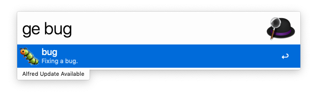
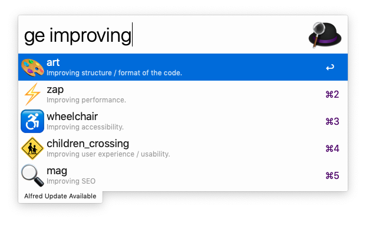
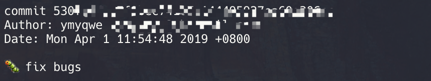

# Alfred-Git-Emoji

:tada: Alfred workflow to copy git emoji

## Requirements
* Alfred Workflow
* [Nodejs](https://nodejs.org/en/) 8+

## Usage

### 1. Type 「ge」 in Alfred

### 2. Type keywords or name after 「ge」

 

### 3. Press `Enter` to copy emoji

### 4. Commit your git message

## Coverage

| emoji                                    | code                          | description                                 | 说明                              |
| ---------------------------------------- | ----------------------------- | ------------------------------------------- | --------------------------------- |
| :art: (调色板)                           | `:art:`                       | Improving structure / format of the code    | 优化代码结构/代码格式             |
| :zap: (闪电)                             | `:zap:`                       | Improving performance                       | 提升性能                          |
| :fire: (火焰)                            | `:fire:`                      | Removing code or files                      | 移除代码或文件                    |
| :bug: (bug)                              | `:bug:`                       | Fixing a bug                                | 修复 bug                          |
| :ambulance: (急救车)                     | `:ambulance:`                 | Critical hotfix                             | 重要补丁                          |
| :sparkles: (火花)                        | `:sparkles:`                  | Introducing new features                    | 引入新功能                        |
| :memo: (备忘录)                          | `:memo:`                      | Writing docs                                | 撰写文档                          |
| :rocket: (火箭)                          | `:rocket:`                    | Deploying stuff                             | 部署功能                          |
| :nail_care: (美甲)                       | `:nail_care:`                 | Updating the UI and style files             | 更新 UI 和样式文件                |
| :tada: (庆祝)                            | `:tada:`                      | Initial commit                              | 初次提交                          |
| :white_check_mark: (复选框选中)          | `:white_check_mark:`          | Updating tests                              | 增加测试                          |
| :lock: (锁)                              | `:lock:`                      | Fixing security issues                      | 修复安全问题                      |
| :apple: (苹果)                           | `:apple:`                     | Fixing something on macOS                   | 修复 macOS 下的问题               |
| :penguin: (企鹅)                         | `:penguin:`                   | Fixing something on Linux                   | 修复 Linux 下的问题               |
| :checkered_flag: (旗帜)                  | `:checked_flag:`              | Fixing something on Windows                 | 修复 Windows 下的问题             |
| :robot:(机器人)                          | `:robot:`                     | Fixing something on Android                 | 修复安卓下的问题                  |
| :green_apple:(绿苹果)                    | `:green_apple:`               | Fixing something on iOS                     | 修复 iOS 下的问题                 |
| :bookmark: (书签)                        | `:bookmark:`                  | Releasing / Version tags                    | 发行/版本标签                     |
| :rotating_light: (警车灯)                | `:rotating_light:`            | Removing linter warnings                    | 移除 linter 警告                  |
| :construction: (施工)                    | `:construction:`              | Work in progress                            | 工作进行中                        |
| :green_heart: (绿心)                     | `:green_heart:`               | Fixing CI Build                             | 修复 CI 构建问题                  |
| :arrow_down:(下箭头)                     | `:arrow_down:`                | Downgrading dependencies                    | 依赖降级                          |
| :arrow_up:(上箭头)                       | `:arrow_up:`                  | Upgrading dependencies                      | 依赖升级                          |
| :pushpin:(图钉)                          | `:pushpin:`                   | Pinning dependencies to specific versions   | 固定依赖版本                      |
| :construction_worker: (工人)             | `:construction_worker:`       | Adding CI build system                      | 添加 CI 构建系统                  |
| :chart_with_upwards_trend:(上升趋势图表) | `:chart_with_upwards_trend:`  | Adding analytics or tracking code           | 添加数据分析或者跟踪代码          |
| :recycle:(回收)                          | `:recycle:`                   | Refactoring code                            | 重构代码                          |
| :whale: (鲸鱼)                           | `:whale:`                     | Work about Docker                           | Docker 相关工作                   |
| :heavy_plus_sign:(加号)                  | `:heavy_plus_sign:`           | Adding a dependency                         | 添加依赖                          |
| :heavy_minus_sign:(减号)                 | `:heavy_minus_sign:`          | Removing a dependency                       | 移除依赖                          |
| :wrench:(扳手)                           | `:wrench:`                    | Changing configuration files                | 修改配置文件                      |
| :globe_with_meridians: (地球)            | `:globe_with_meridians:`      | Internationalization and localization       | 国际化与本地化                    |
| :wrench:(扳手)                           | `:wrench:`                    | Changing configuration files                | 修改配置文件                      |
| :pencil2: (铅笔)                         | `:pencil2:`                   | Fixing typos                                | 修复 typo                         |
| :hankey: (屎)                            | `:hankey:`                    | Writing bad code that needs to be improved  | 写了需要提升的垃圾代码            |
| :rewind: (倒带)                          | `:rewind:`                    | Reverting changes                           | 回滚变化                          |
| :twisted_rightwards_arrows: (扭曲右箭头) | `:twisted_rightwards_arrows:` | Merging branches                            | 合并分支                          |
| :package: (包裹)                         | `:package:`                   | Updating compiled files or packages         | 更新编译后文件或者依赖包          |
| :alien: (外星人)                         | `:alien:`                     | Updating code due to external API changes   | 外部 API 变更导致的更新代码       |
| :truck: (卡车)                           | `:truck:`                     | Moving or renaming files                    | 移动或重命名文件                  |
| :page_facing_up: (许可证)                | `:page_facing_up:`            | Adding or updating license                  | 添加或更新许可证                  |
| :boom: (爆炸)                            | `:boom:`                      | Introducing breaking changes                | 引入重大变更                      |
| :bento: (便当)                           | `:bento:`                     | Adding or updating assets                   | 添加或更新附件                    |
| :ok_hand: (OK)                           | `:ok_hand:`                   | Updating code due to code review changes    | 根据 code review 更新代码         |
| :wheelchair: (轮椅)                      | `:wheelchair:`                | Improving accessibility                     | 优化辅助选项                      |
| :bulb: (灯泡)                            | `:bulb:`                      | Documenting source code                     | 为源代码添加文档                  |
| :beers: (啤酒)                           | `:beers:`                     | Writing code drunkenly                      | 喝醉时写的代码                    |
| :speech_balloon: (对话气球)                  | `:speech_balloon:`            | Updating text and literals                  | 更新文本和文字                    |
| :card_file_box: (卡片文件盒)             | `:card_file_box:`             | Performing database related changes         | 数据库相关变化                    |
| :loud_sound: (大喇叭)                    | `:loud_sound:`                | Adding logs                                 | 添加日志                          |
| :mute: (静音)                            | `:mute:`                      | Removing logs                               | 删除日志                          |
| :busts_in_silhouette: (人与影)           | `:busts_in_silhouette:`       | Adding contributor                          | 添加贡献者                        |
| :children_crossing: (注意小孩)           | `:children_crossing:`         | Improving user experience / usability       | 提升交互和易用性                  |
| :building_construction: (建筑建造中)     | `:building_construction:`     | Making architectural changes                | 做结构性改变                      |
| :iphone: (iphone)                        | `:iphone:`                    | Working on responsive design                | 做响应式调整                      |
| :clown_face: (小丑)                      | `:clown_face:`                | Mocking things                              | 模拟数据                          |
| :egg: (蛋)                               | `:egg:`                       | Adding an easter egg                        | 添加彩蛋                          |
| :see_no_evil: (挡眼睛)                   | `:see_no_evil:`               | Adding or updating a .gitignore file        | 添加或更新.gitignore              |
| :camera_flash: (相机闪光)              | `:camera_flash:`              | Adding or updating snapshots                | 添加或更新快照                    |
| :alembic: (蒸馏器)                       | `:alembic:`                   | Experimenting new things                    | 实验性特性                        |
| :mag: (放大镜)                           | `:mag:`                       | Improving SEO                               | 优化 SEO                          |
| :wheel_of_dharma: (佛法轮)               | `:wheel_of_dharma:`           | Work about Kubernetes                       | Kubernets 相关工作                |
| :label: (标签)                           | `:label:`                     | Adding or updating types (Flow, TypeScript) | 添加或更新类型 (Flow, TypeScript) |

## Reference

1. [Emoji cheatsheet](https://www.webfx.com/tools/emoji-cheat-sheet/)
2. [Gitmoji](https://gitmoji.carloscuesta.me/)
3. [Git commit emoji cn](https://github.com/liuchengxu/git-commit-emoji-cn)
