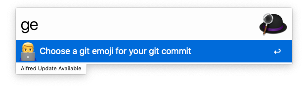

# Alfred-Git-Emoji

:tada: Alfred workflow to copy git emoji

## Usage

### 1. Type 「ge」 in Alfred

### 2. Type keywords or name after 「ge」

 

### 3. Press `Enter` to copy emoji

### 4. Commit your git message

## Reference

1. [Emoji cheatsheet](https://www.webfx.com/tools/emoji-cheat-sheet/)
2. [Gitmoji](https://gitmoji.carloscuesta.me/)
3. [Git commit emoji cn](https://github.com/liuchengxu/git-commit-emoji-cn)
